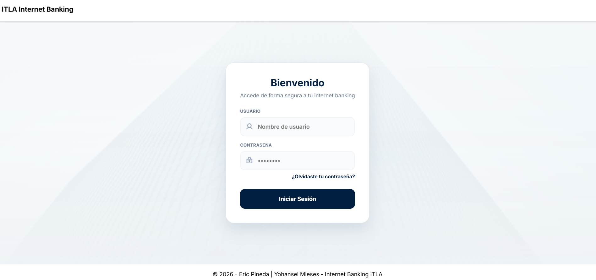
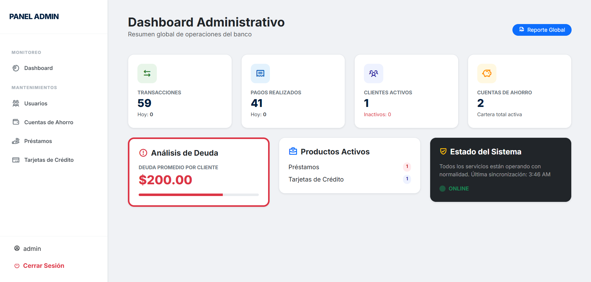
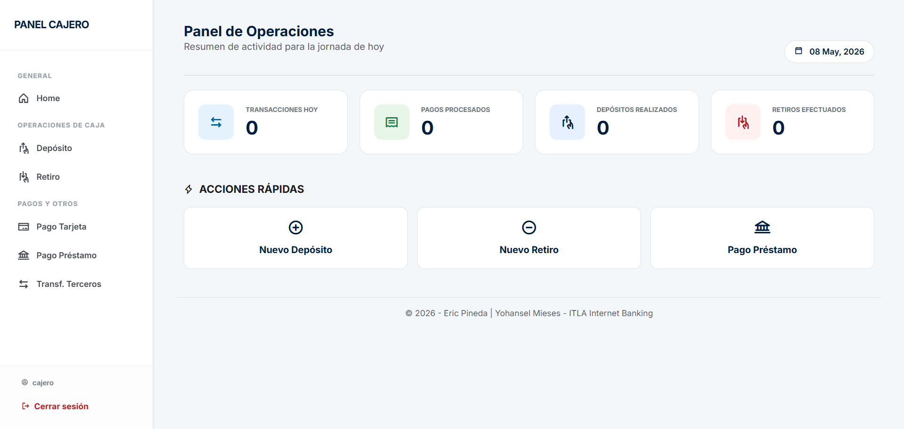
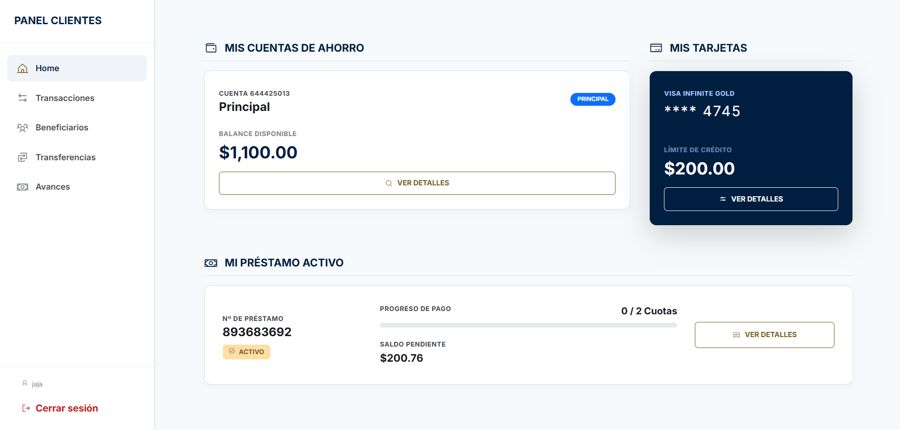
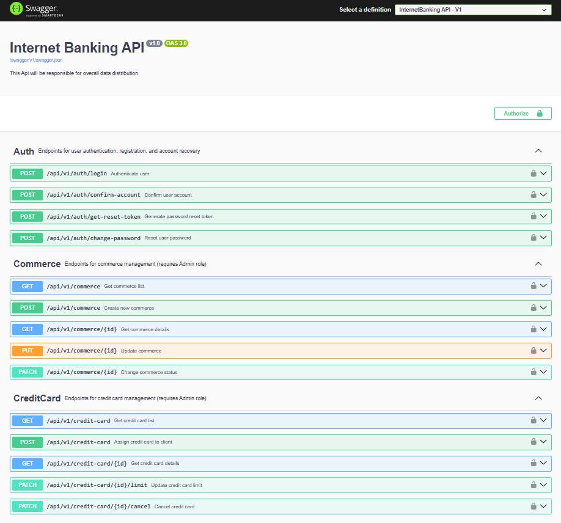
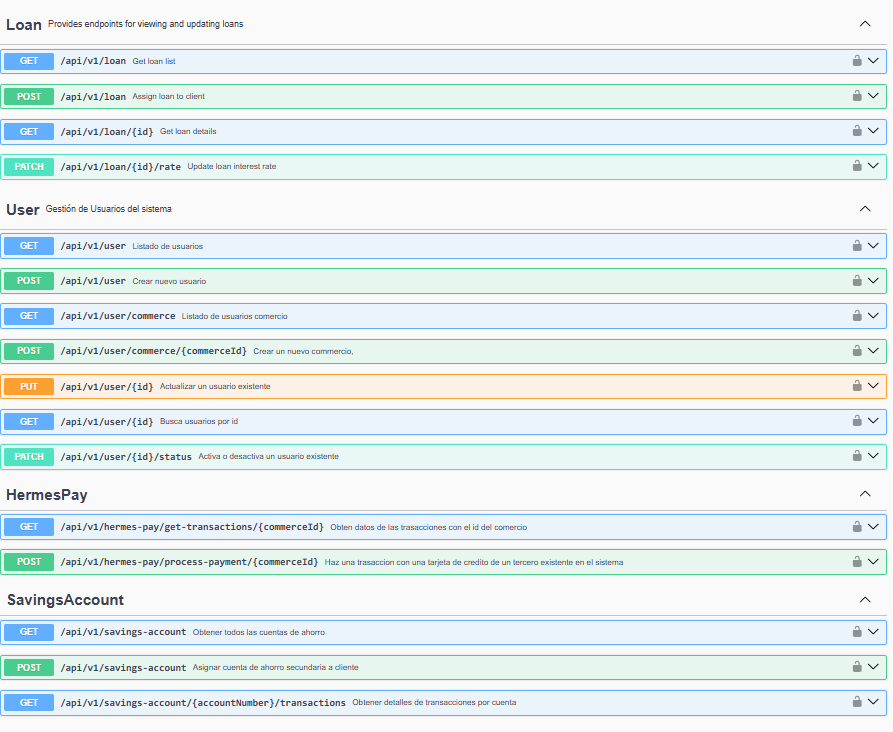

# InternetBankingApp 

Internet Banking es una WebApp/WebApi construida en .NET 9 con arquitectura CQRS + MediatR, seguridad JWT/Identity y autenticación/notificaciones por correo.

## ⚙️ Funcionalidades principales

- Gestión de usuarios con roles (Admin, Commerce, Customer, Cashier)
  
- Gestión de comercios: creación, actualización, activación/desactivación con reglas de negocio

- Préstamos: asignación de préstamos, validación de préstamos activos, generación de tabla de amortización

- Cuentas de ahorro: cuentas primarias/secundarias, actualización de balances

- Pagos con tarjeta de crédito: validación de límites, registro de transacciones, notificación a cliente y comercio

- Seguridad:
  - WebApi → autenticación JWT
  - WebApp → autenticación Cookies
- Jobs automáticos con Hangfire: actualización de cuotas vencidas

## 📂 Arquitectura – Onion Architecture

- Application → CQRS, Handlers, DTOs, Validadores
- Domain → Entidades, enums, interfaces de repositorios
- Infrastructure → Persistencia, Identity, servicios externos
- InternetBankingApi → API REST (JWT)
- InternetBankingWeb → WebApp MVC (Cookies)

## 🔧 Tecnologías

- C# ASP.NET Core 9
- Entity Framework Core
- MediatR + CQRS
- FluentValidation
- AutoMapper
- Identity + JWT
- Hangfire
- Swagger/OpenAPI

## 🖼️ Screenshots

- Login
  
- Home Admin
  
- Home Cashier
  
- Home Customer
  
- Swagger Endpoints
  
  

## 👨‍💻 Equipo de Desarrollo

- Eric Pineda
  - eccpineda@gmail.com  
- Yohansel Mieses
  - miesesyohansel@gmail.com
